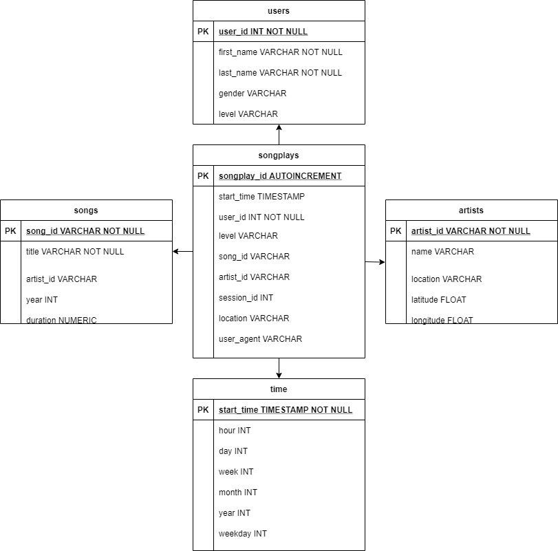

# Data Lake with Spark 

## Introduction

A music streaming startup, **Sparkify**, has grown their user base and song database even more and want to move their data warehouse to a data lake. Their data resides in S3, in a directory of JSON logs on user activity on the app, as well as a directory with JSON metadata on the songs in their app.

As their data engineer, you are tasked with building an ETL pipeline that extracts their data from S3, processes them using Spark, and loads the data back into S3 as a set of dimensional tables. This will allow their analytics team to continue finding insights in what songs their users are listening to.

## Data Model 

This project use a single fact table to store measure data *(songplays)* and few dimension tables to store some attributes about data.



**songplays** --> records in log data associated with song plays i.e. records with page ```NextSong```.

**users** --> users in the app.

**songs** --> songs in music database.

**artists** --> artists in music database.

**time** --> timestamps of records in **songplays** broken down into specific units.


## ETL Pipeline

There are few steps to run in order to insert data into the tables.

**etl.ipynb** : exploratory analysis of the data sources, extraction of a sample of the data to build a first version of the ETLs necessary for the ingestion in the data lake and the creation of an output S3 bucket using AWS CLI.

**etl.py** : read, transform and load data into the new database using a staging area where the files stored in S3 were COPY into Redshift.


## Hints

Doing the project some important point were found and I'd like to share them:

1. Spark installation on Windows 10: [Spark Pre-built for Apache Hadoop 2.7](https://spark.apache.org/downloads.html)

2. Problem running Hadoop on Windows: [WINUTILS.EXE](https://cwiki.apache.org/confluence/display/HADOOP2/WindowsProblems)

3. Transform epoch dates: [PySpark dataframe epoch dates](https://stackoverflow.com/questions/49971903/converting-epoch-to-datetime-in-pyspark-data-frame-using-udf)

4. Joins pyspark dataframes with multiples conditions: [PySpark Join With Multiple Columns & Conditions](https://sparkbyexamples.com/pyspark/pyspark-join-two-or-multiple-dataframes/)

5. SaveMode parquet files: [Append or Overwrite](https://sparkbyexamples.com/pyspark/pyspark-read-and-write-parquet-file/)

6. Saving parquet files with partitions: [PySpark Partitions](https://sparkbyexamples.com/pyspark/pyspark-partitionby-example/)

7. Create a S3 bucket with AWS CLI: ```aws s3 mb s3://udacity-datalake-sparkify-edls --region us-west-2```

## FAQ

**1. Why is Operation timed out on the ssh connection?**

AWS disable SSH port 22 by default and for this reason the connection expires, before establishing a connection with the EMR cluster it is necessary to authorize inbound SSH traffic (port 22) from trusted clients such as your computer's IP address (0.0.0.0/0).

[To allow SSH access for trusted sources for the ElasticMapReduce-master security group](https://docs.aws.amazon.com/emr/latest/ManagementGuide/emr-connect-ssh-prereqs.html)

**2. How can I create an EMR cluster using the CLI?**

```
aws emr create-cluster --name 'my-cluster-spark' \
--service-role EMR_DefaultRole \
--release-label emr-5.20.0 \
--instance-count 4 \
--instance-type m5.xlarge \
--applications Name=Ganglia Name=Spark Name=Zeppelin \
--ec2-attributes KeyName=cluster-emr-key,InstanceProfile=EMR_EC2_DefaultRole,SubnetId='subnet-015417f7b15d5f897' \
--log-uri s3://s3-for-emr-cluster-udacity-mse/ --region us-west-2
```

Check if the EMR cluster is up and running: ```aws emr list-clusters --active```


**3. How do I run ETL.py on Windows 10?**

- Install Putty
- Set up an SSH tunnel to the master node using PuTTY, follow these [steps](https://docs.aws.amazon.com/emr/latest/ManagementGuide/emr-ssh-tunnel.html) to open a SSH tunnel.
- Once an SSH tunnel is open throught Putty, execute this command to run *etl.py*: ```spark-submit etl.py```


